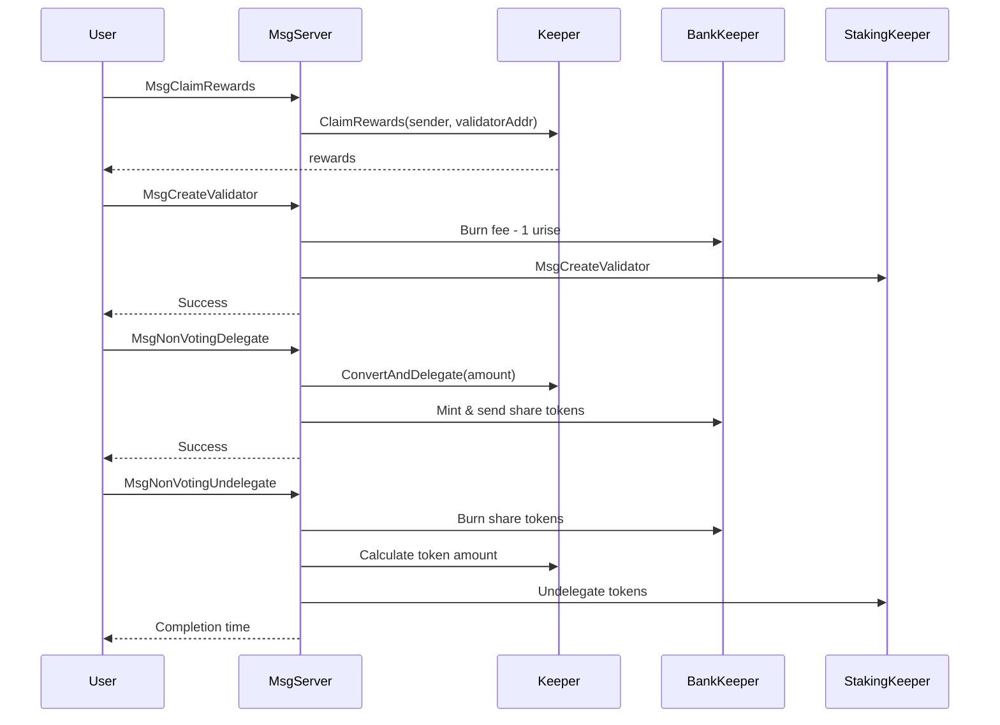
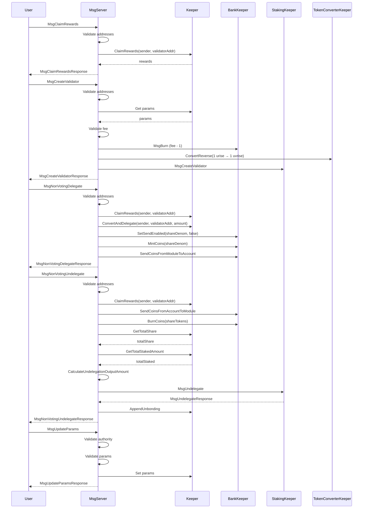

# x/shareclass Module Documentation

The `x/shareclass` module provides a non-voting delegation mechanism for the Sunrise blockchain. It allows users to delegate tokens to validators without receiving voting power, while still earning rewards through a share token system.

## Overview

The `x/shareclass` module implements a system where:


1. Users can create validators with a required fee
2. Users can delegate tokens without receiving voting rights
3. Non-transferable share tokens represent delegation positions
4. Delegators can claim rewards proportional to their share


## Messages
The module supports the following messages:

### `MsgClaimRewards`

Allows users to claim accumulated staking rewards from a validator.

```go
type MsgClaimRewards struct {
    Sender           string // address claiming rewards
    ValidatorAddress string // validator address to claim from
}
```

### `MsgCreateValidator`
Creates a new validator in the Sunrise network with a required fee.

```go
type MsgCreateValidator struct {
    ValidatorAddress  string                  // address of the validator
    Description       stakingtypes.Description // validator description
    Commission        stakingtypes.CommissionRates // commission rates
    MinSelfDelegation sdk.Int                // minimum self delegation amount
    Pubkey            *codectypes.Any        // consensus pubkey
    Fee               sdk.Coin               // fee required to create validator
}
```

During validator creation:

- Most of the fee is burned (fee - 1 urise)
- 1 urise is converted to 1 uvrise
- The converted amount is staked to the new validator

### `MsgNonVotingDelegate`

Delegates tokens to a validator without receiving voting power.

```go
type MsgNonVotingDelegate struct {
    Sender           string   // delegator address
    ValidatorAddress string   // validator to delegate to
    Amount           sdk.Int  // amount to delegate
}
```

When delegating:

- Any pending rewards are claimed
- Tokens are converted and delegated
- Non-transferable share tokens are minted and sent to the delegator

### `MsgNonVotingUndelegate`

Undelegates tokens previously delegated with non-voting delegation.

```go
type MsgNonVotingUndelegate struct {
    Sender           string   // delegator address
    ValidatorAddress string   // validator to undelegate from
    Share            sdk.Int  // amount of share tokens to burn
    Recipient        string   // optional recipient for undelegated tokens
}
```

During undelegation:

- Any pending rewards are claimed
- Share tokens are sent to the module and burned
- The corresponding stake amount is calculated based on the validator's total stake
- Tokens are undelegated from the validator
- An unbonding record is created

### `MsgUpdateParams`
Updates the module parameters (governance-only).

```go
type MsgUpdateParams struct {
    Authority string         // governance authority
    Params    types.Params   // new parameters
}
```

## Diagram



## Share Token System
The module uses non-transferable share tokens to track delegations:

- Each validator has a unique share token denomination
- Share tokens are minted during delegation
- Share tokens cannot be transferred between accounts
- During undelegation, the share tokens are burned
- The actual token amount received during undelegation is proportional to the validator's current stake


## Rewards Distribution
Rewards are distributed based on the share of the validator's total delegation:

- Rewards accumulate over time based on the validator's performance
- Users can claim rewards at any time
- Rewards are automatically claimed during delegation and undelegation operations