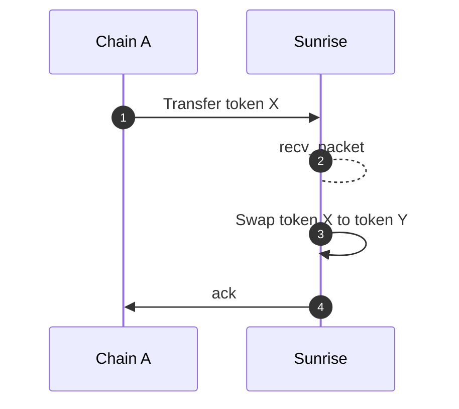
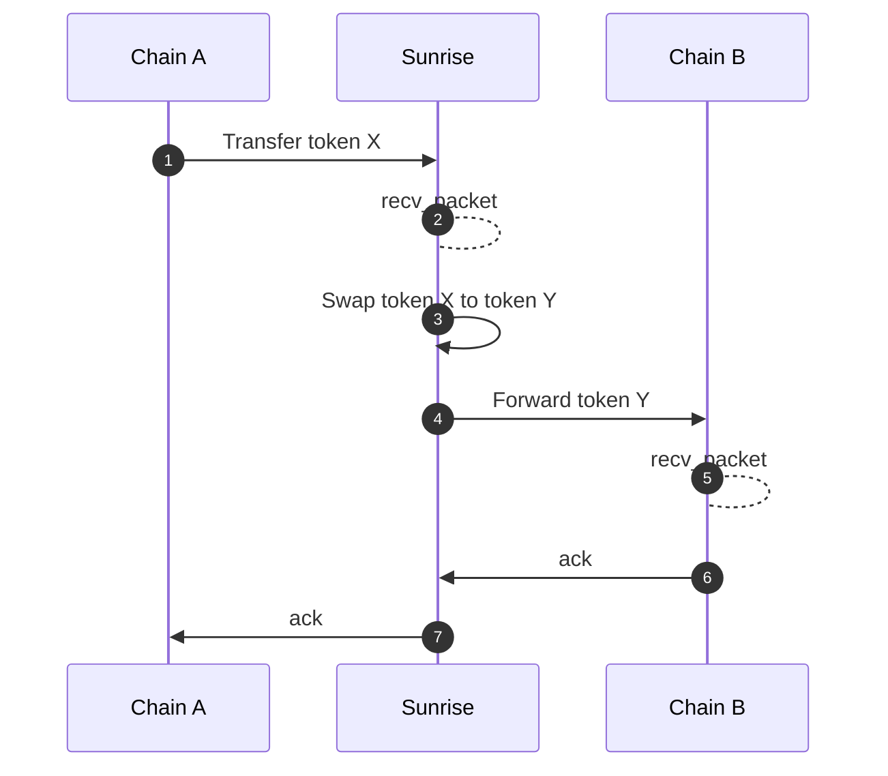
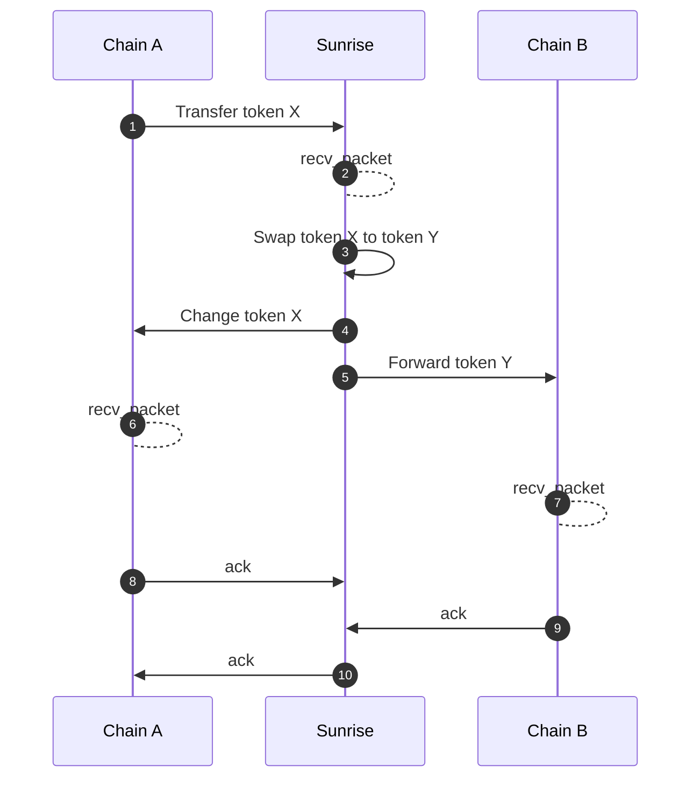

# swap

## MsgSwapExactAmountIn

## MsgSwapExactAmountOut

## ICS20 Middleware

Swap functions also can be executed by ICS20 token transfer packet automatically.

### Metadata

JSON string of marshalled `PacketMetadata` should be inserted in the `memo` field of ICS20 transfer packet.

```typescript
type PacketMetadata = {
  [namespace: string]: unknown;
  swap?: SwapMetadata;
};

type SwapMetadata = {
  interface_provider: string;
  route: Route;

  forward?: ForwardMetadata;
} & (
  | {
      exact_amount_in: {
        min_amount_out: string;
      };
    }
  | {
      exact_amount_out: {
        amount_out: string;
        change?: ForwardMetadata;
      };
    }
);

type ForwardMetadata = {
  receiver: string;
  port: string;
  channel: string;
  timeout: string;
  retries: number;
  next?: PacketMetadata;
};
```

`ForwardMetadata` is quoted from [Packet Forward Middleware](https://github.com/cosmos/ibc-apps/tree/main/middleware/packet-forward-middleware).

### Sequence diagrams

#### Neither Return nor Forward



#### Forward



#### Change and Forward

If the exact output amount is designated for the swap, the remainder input amount will occur.
There is a function to automatically refund the remainder input amount.



### Receiver address

After the swapping has been executed, the acknowledgement of "Transfer token X" will be always success even if the next return / forward packet failed. The swapped funds are preserved in the balance of the receiver address.
