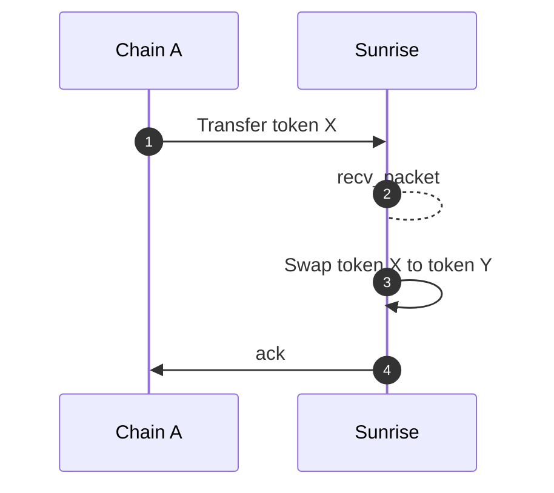
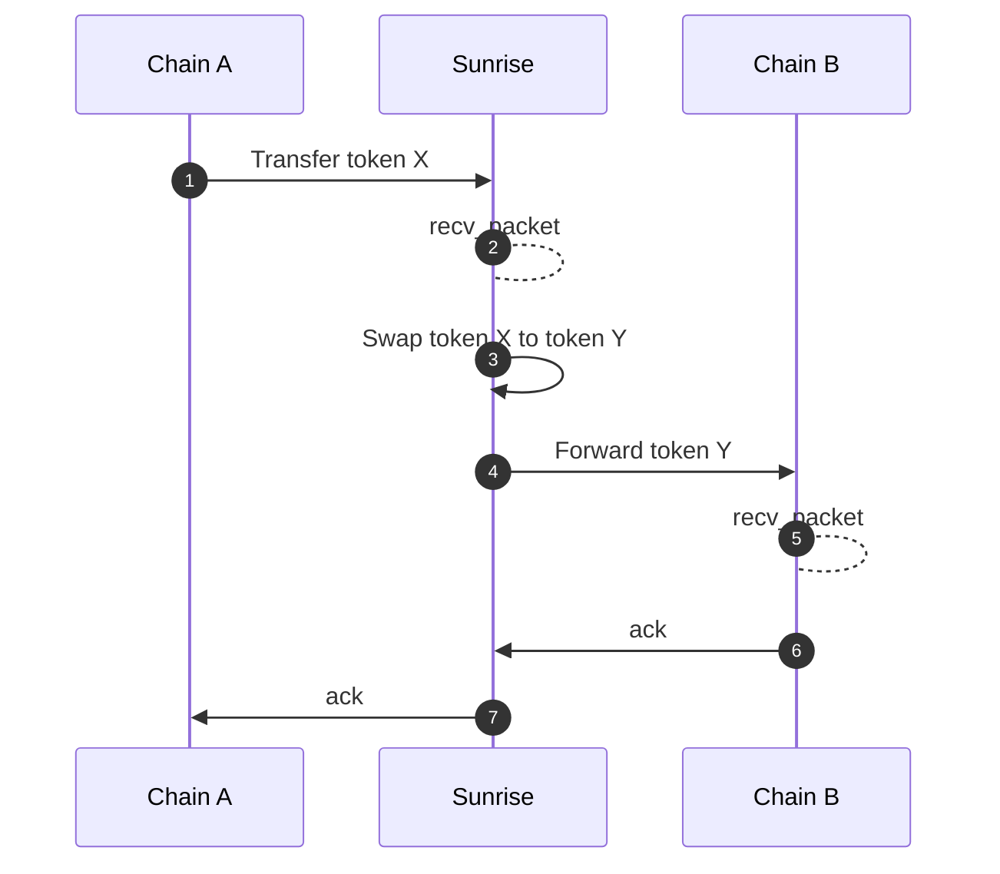
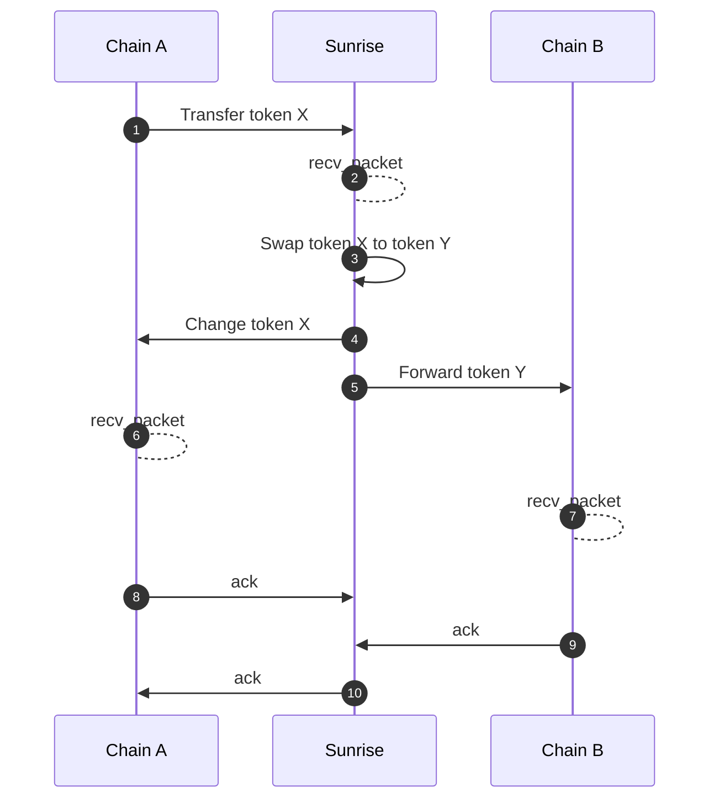

# swap

## Spec

### Route

This module accepts a swap route with recursive struct.

```protobuf

message RoutePool {
  uint64 pool_id = 1;
}

message RouteSeries {
  repeated Route routes = 1 [
    (gogoproto.nullable)   = false,
    (amino.dont_omitempty) = true
  ];
}

message RouteParallel {
  repeated Route routes = 1 [
    (gogoproto.nullable)   = false,
    (amino.dont_omitempty) = true
  ];
  repeated string weights = 2 [
    (cosmos_proto.scalar)  = "cosmos.Dec",
    (gogoproto.customtype) = "cosmossdk.io/math.LegacyDec",
    (gogoproto.nullable)   = false,
    (amino.dont_omitempty) = true
  ];
}

message Route {
  string denom_in = 1;
  string denom_out = 2;
  oneof strategy {
    RoutePool pool = 3;
    RouteSeries series = 4;
    RouteParallel parallel = 5;
  }
}
```

### Params

This module has these params

- `interface_fee_rate`: Interface providers (e.g. frontend web-app provider) can receive a certain rate of the fee from the swap tx.

## Messages

### MsgSwapExactAmountIn

By sending tx with this msg, users can swap tokens with designating the amount for input.

### MsgSwapExactAmountOut

By sending tx with this msg, users can swap tokens with designating the amount for output.

## Query

See [openapi.yml](../../docs/static/openapi.yml) for details

- Params
- IncomingInFlightPackets
- IncomingInFlightPacket
- OutgoingInFlightPackets
- OutgoingInFlightPacket
- CalculationSwapExactAmountIn  
- CalculationSwapExactAmountOut

## ICS20 Middleware

Swap functions also can be executed by ICS20 token transfer packet automatically.

### Metadata

JSON string of marshalled `PacketMetadata` should be inserted in the `memo` field of ICS20 transfer packet.

```typescript
type PacketMetadata = {
  [namespace: string]: unknown;
  swap?: SwapMetadata;
};

type SwapMetadata = {
  interface_provider: string;
  route: Route;

  forward?: ForwardMetadata;
} & (
  | {
      exact_amount_in: {
        min_amount_out: string;
      };
    }
  | {
      exact_amount_out: {
        amount_out: string;
        change?: ForwardMetadata;
      };
    }
);

type ForwardMetadata = {
  receiver: string;
  port: string;
  channel: string;
  timeout: string;
  retries: number;
  next?: PacketMetadata;
};
```

`ForwardMetadata` is quoted from [Packet Forward Middleware](https://github.com/cosmos/ibc-apps/tree/main/middleware/packet-forward-middleware).

### Sequence diagrams

#### Neither Return nor Forward



#### Forward



#### Change and Forward

If the exact output amount is designated for the swap, the remainder input amount will occur.
There is a function to automatically refund the remainder input amount.



### Receiver address

After the swapping has been executed, the acknowledgement of "Transfer token X" will be always success even if the next change / forward packet failed. The swapped funds are preserved in the balance of the receiver address.
